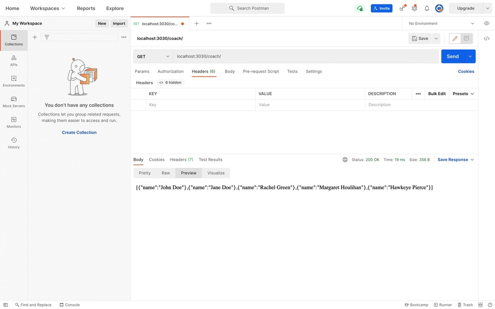

# rjstudio


### Setup
```
1.  git clone https://github.com/sagartyagi121/rpgfreeweb.git
2.  npm i
3.  You should have a .env file similar to ./.env.example in the project root
3.  npm start   - for production and testing 
4.  npm run dev - for development 

```

    +---------+------------------------------+--------------------------------+
    | Methods |             Urls             |            Actions             |
    +---------+------------------------------+--------------------------------+
    | Get     | /coach/                      | Get all coaches                |
    | Get     | /coach/avaslots/:name        | Get slots by caoch names       |
    | Post    | /coach/book                  | Book a slot                    |
    +---------+------------------------------+--------------------------------+




